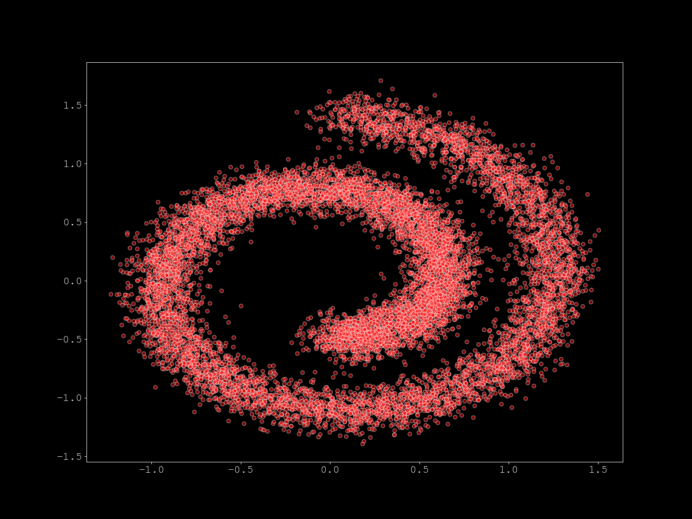
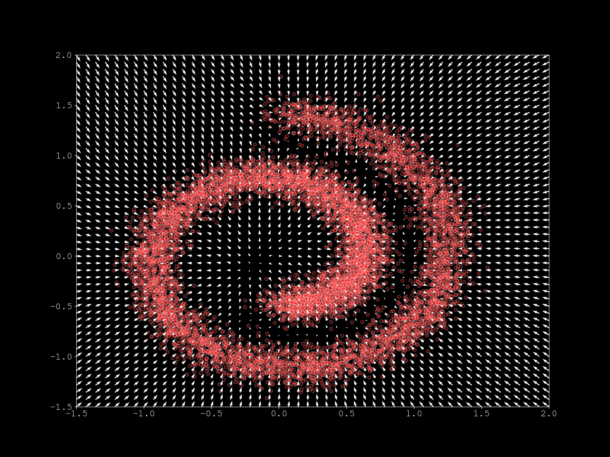
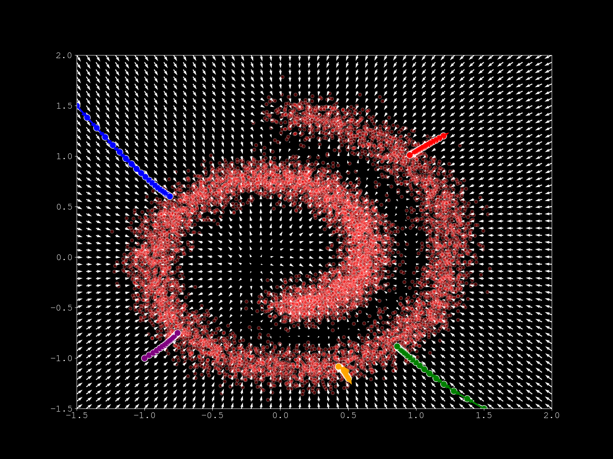
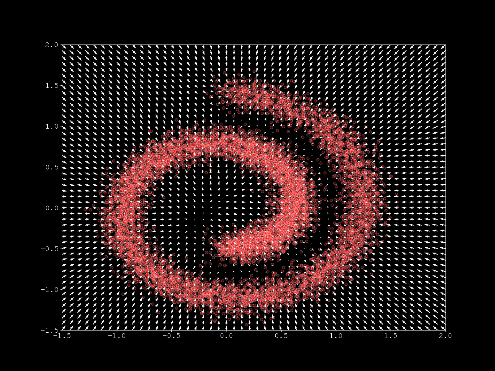
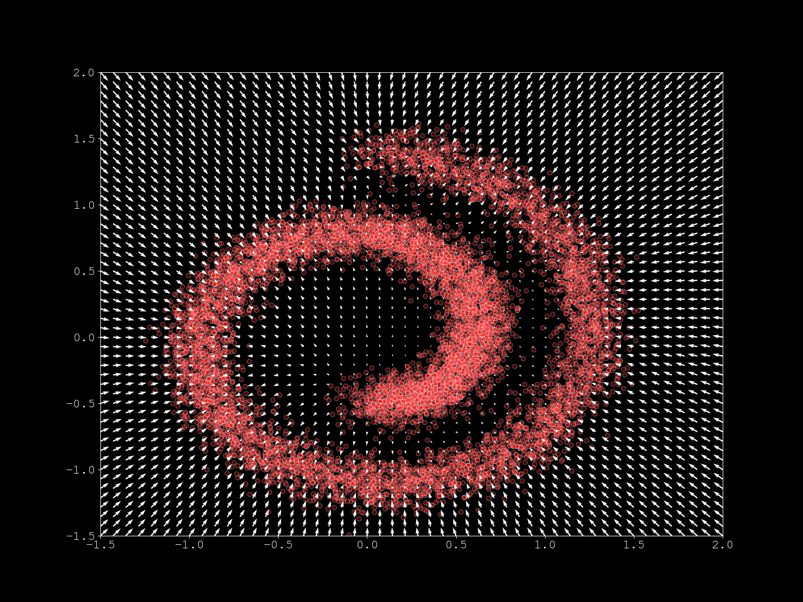
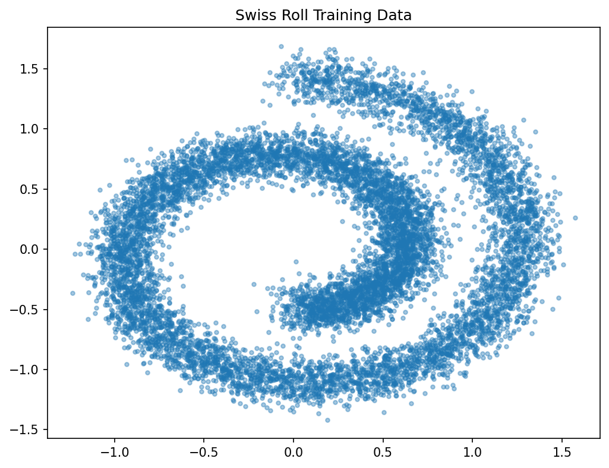
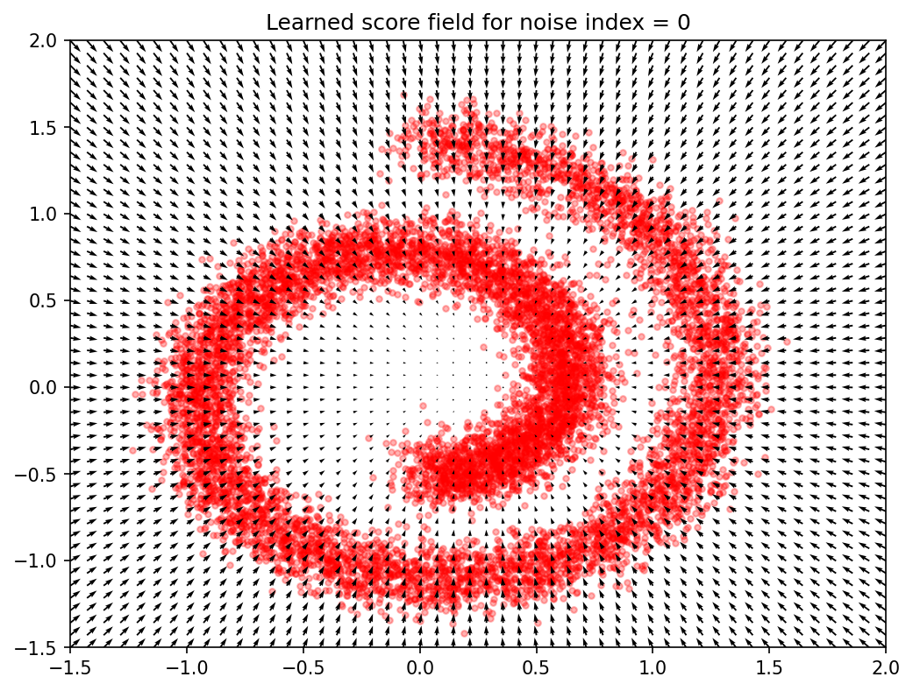
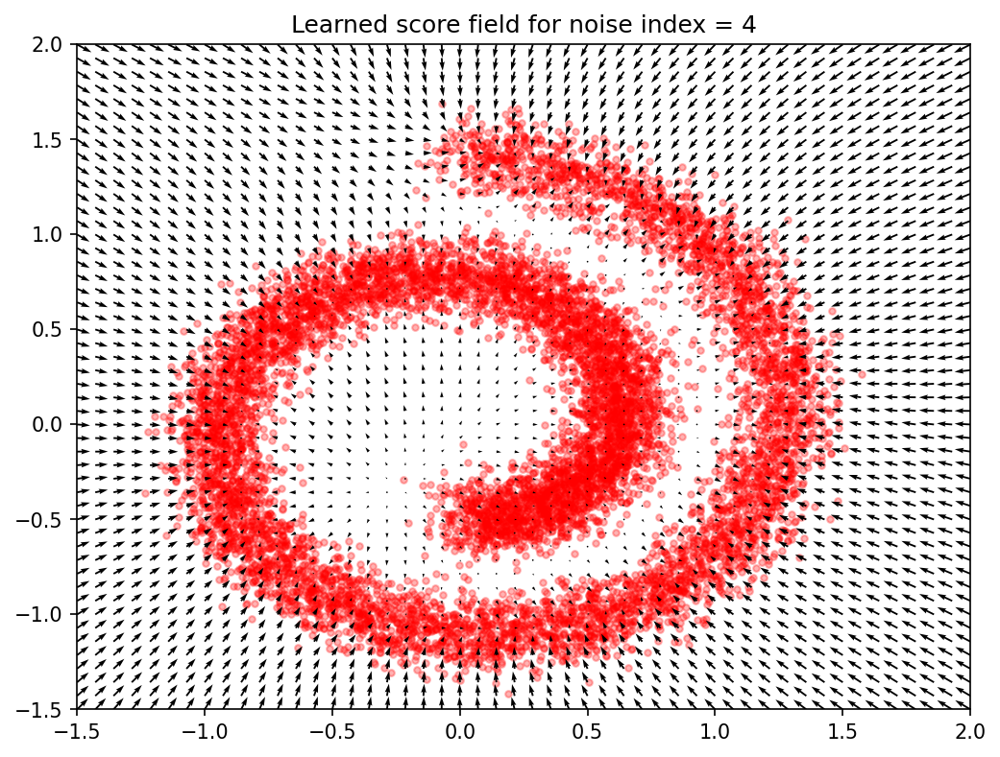
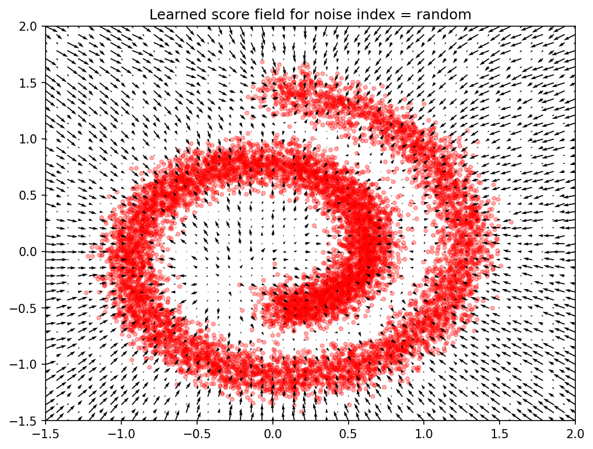

# Score Matching Variants: From Theory to Practice

A comprehensive tutorial repository exploring score-based generative modeling techniques, from classical score matching to noise-conditional score networks (the foundation of modern diffusion models).

## Overview

This repository implements and visualizes four key approaches to score-based learning on a toy 2D Swiss Roll dataset:

1. **Classical Score Matching** - Learning score functions via explicit score matching
2. **Sliced Score Matching** - Efficient score matching using random projections
3. **Denoising Score Matching** - Score learning through data perturbation
4. **Noise-Conditional Score Networks (NCSN)** - Multi-scale score learning (foundation for diffusion models)

Each experiment is self-contained with detailed mathematical explanations and produces visualizations of learned score fields.

## Installation

```bash
poetry install
```

## Experiments

### 1. Score Matching

**File:** `experiments/1_score_matching.py`

The foundational approach by Hyvärinen (2005). Instead of learning the probability density p(x) directly, we learn its score function ∇ log p(x) - the gradient of log-density.

**Key idea:** Train a neural network s_θ(x) to match the true score by minimizing:
```
L = E[||s_θ(x) - ∇ log p(x)||²]
```

**Run:**
```bash
poetry run python experiments/1_score_matching.py
```

**Results:**



*Swiss Roll training data*



*Learned score field - arrows point toward higher probability regions*



*Sampling dynamics following the learned score field*

---

### 2. Sliced Score Matching

**File:** `experiments/2_sliced_score_matching.py`

An efficient variant by Song et al. (2019) that avoids computing the Hessian by using random projections.

**Key idea:** Instead of matching scores in all directions, project onto random directions v and minimize:
```
L = E_v[v^T ∇ s_θ(x) v + ½||s_θ(x)||²]
```

This is computationally cheaper than classical score matching while maintaining effectiveness.

**Run:**
```bash
poetry run python experiments/2_sliced_score_matching.py
```

**Results:**



*Score field learned via sliced score matching*

---

### 3. Denoising Score Matching

**File:** `experiments/3_denoising_score_matching.py`

A practical approach by Vincent (2011) that learns scores by denoising corrupted data.

**Key idea:** Perturb data with Gaussian noise x̃ = x + ε, then train to predict:
```
s_θ(x̃) ≈ -(x̃ - x)/σ²
```

This avoids computing true data scores and works well in practice.

**Run:**
```bash
poetry run python experiments/3_denoising_score_matching.py
```

**Results:**



*Score field learned via denoising score matching*

---

### 4. Noise-Conditional Score Networks (NCSN)

**File:** `experiments/4_noise_conditional_score_networks.py`

The breakthrough approach by Song & Ermon (2019) that laid the foundation for modern diffusion models.

**Key ideas:**
- Learn scores at **multiple noise scales** simultaneously: σ₁ > σ₂ > ... > σ_K
- Use a **conditional network** s_θ(x, σ) that takes noise level as input
- **Anneal noise during sampling** from large → small, moving from coarse to fine distributions
- Addresses manifold hypothesis and low-density regions

This approach solves two major problems:
1. **Manifold inconsistency** - Real data lies on low-dimensional manifolds
2. **Low-density instability** - Scores are ill-defined in low-density regions

**Run:**
```bash
poetry run python experiments/4_noise_conditional_score_networks.py
```

**Results:**



*Swiss Roll training data*



*Score field at highest noise level (σ₁) - broad, smooth distribution*



*Score field at lowest noise level (σ_K) - sharp, detailed distribution*



*Score field with random noise levels mixed*

---

## Key Insights

1. **Score matching** learns probability gradients instead of densities, enabling flexible generative modeling
2. **Sliced score matching** makes training efficient via random projections
3. **Denoising score matching** provides a practical training objective via data perturbation
4. **NCSN** extends denoising to multiple noise scales, solving fundamental issues and enabling modern diffusion models

## Project Structure

```
score-matching-variants/
├── experiments/          # Self-contained tutorial scripts
│   ├── 1_score_matching.py
│   ├── 2_sliced_score_matching.py
│   ├── 3_denoising_score_matching.py
│   └── 4_noise_conditional_score_networks.py
├── src/                  # Shared utilities
│   ├── data.py
│   ├── models.py
│   ├── losses.py
│   └── utils.py
└── results/              # Generated figures
```
## References

- Hyvärinen, A. (2005). Estimation of non-normalized statistical models by score matching
- Vincent, P. (2011). A connection between score matching and denoising autoencoders
- Song, Y., & Ermon, S. (2019). Generative modeling by estimating gradients of the data distribution (NCSN)
- Song, Y., Garg, S., Shi, J., & Ermon, S. (2019). Sliced score matching
